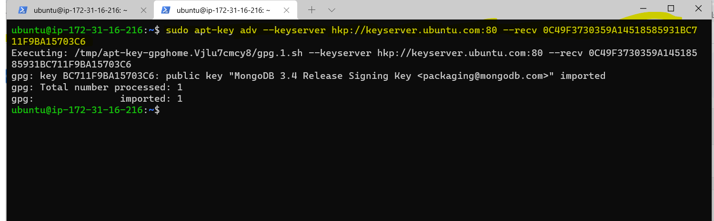
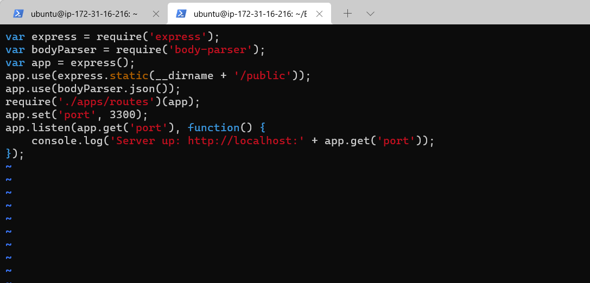
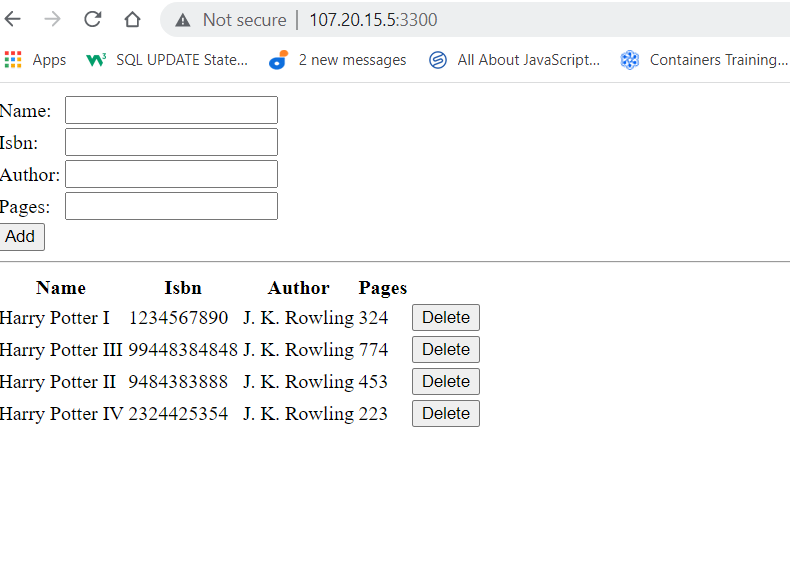

# Project 4
## Title: MEAN STACK IMPLEMENTATION IN AWS CLOUD
### TASK: 
Implement a simple Book Register Web Form using MEAN stack.

MEAN -MONGODB + EXPRESSJS + ANGULARJS + NODE.JS

* MongoDB: This is a document based, No-SQL database. It will store data and allow data retrieval.
* ExpressJS: This is back-end, server-side Application framework that will make requests to the MongoDB for Reads and Writes.
* AngularJS: This is the front-end application framework that will handle client and server requests.
* Node.js: This is the JavaScript runtime environment that will accept requests and display results to end users.

<!-- Horizontal Rule -->
----------------------------------------------------

### Implementation Steps:
* Step 1 - Install NodeJS
Node.js is used to setup the Express routes and AngularJS controllers.

<!-- Code Blocks -->
```bash
$ sudo apt update
```
Updating package repository


<!-- Code Blocks -->
```bash
$ sudo apt upgrade
```
Upgrading package repository


<!-- Code Blocks -->
```bash
$ sudo apt -y install curl dirmngr apt-transport-https lsb-release ca-certificates

$ curl -sL https://deb.nodesource.com/setup_12.x | sudo -E bash -
```
Adding certificates


<!-- Code Blocks -->
```bash
$ sudo apt install -y nodejs
```
Installing NodeJS


<!-- Horizontal Rule -->
----------------------------------------------------


* Step 2 - Install MongoDB
 
 <!-- Code Blocks -->
```bash
$ sudo apt sudo apt-key adv --keyserver hkp://keyserver.ubuntu.com:80 --recv 0C49F3730359A14518585931BC711F9BA15703C6

$ echo "deb [ arch=amd64 ] https://repo.mongodb.org/apt/ubuntu trusty/mongodb-org/3.4 multiverse" | sudo tee /etc/apt/sources.list.d/mongodb-org-3.4.list
```
Pre-MongoDB Install



<!-- Code Blocks -->
```bash
$ sudo apt install -y mongodb
```
Installing MongoDB


<!-- Code Blocks -->
```bash
$ sudo service mongodb start
```
Starting the Server and verifying the service is up and running


<!-- Code Blocks -->
```bash
$ sudo apt install -y npm
```
Installing Node Package Manager (npm)


<!-- Code Blocks -->
```bash
$ sudo npm install body-parser

$ sudo npm install -g npm@8.5.4
```
Installing body-parser package


Upgrading npm to 8.5.4 version


<!-- Code Blocks -->
```bash
$ mkdir Books && cd Books
```
Creating 'Books' directory


<!-- Code Blocks -->
```bash
$ npm init
```
Initializing npm project


<!-- Code Blocks -->
```bash
$ vim server.js
```
Creating file server.js


<!-- Horizontal Rule -->
----------------------------------------------------

* Step 3 - Install Express and Setup routes to the server.

<!-- Code Blocks -->
```bash
$ sudo npm install express mongoose
```
Installing Express and Mongoose package


<!-- Code Blocks -->
```bash
$ mkdir apps && cd apps
```
Creating apps folder in Books directory


<!-- Code Blocks -->
```bash
$ vim routes.js
```
Creating and Editing routes.js file 


<!-- Code Blocks -->
```bash
$ mkdir models && cd models
```
Creating models directory in apps folder 


<!-- Code Blocks -->
```bash
$ vim book.js
```
Creating book.js file in models directory 


<!-- Horizontal Rule -->
----------------------------------------------------

* Step 4 - Access the routes with AngularJS. AngularJS will connect our web page with Express and perform actions on the book register

<!-- Code Blocks -->
```bash
$ mkdir public && cd public
```
Creating public directroy in Books folder 


<!-- Code Blocks -->
```bash
$ vim script.js
```
Creating script.js file in public directory 


<!-- Code Blocks -->
```bash
$ vim index.html
```
Creating index.html file in public directory 


<!-- Code Blocks -->
```bash
$ node server.js
```
Starting server from Books directory 


<!-- Code Blocks -->
```bash
$ curl -s http://localhost:3300
```
Verifying Application from cmd 


Verifying Application from url

http://107.20.15.5:3300
