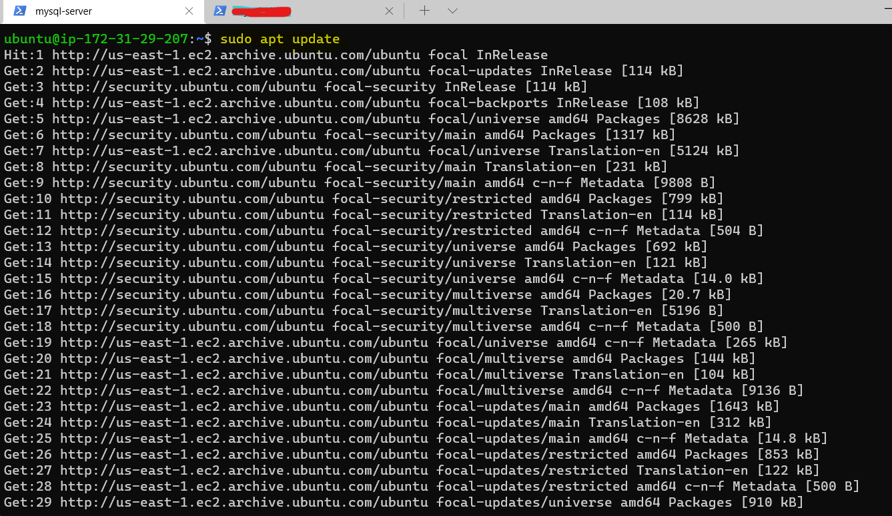
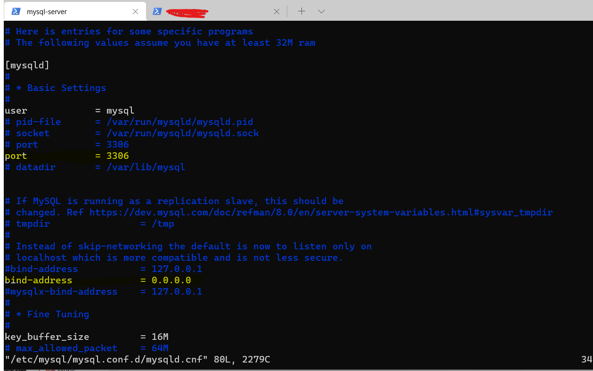

# Project 5
## Title: CLIENT/SERVER ARCHITECTURE USING MYSQL RDMS
### Description: 
This Project demonstrates how to implement a basic client-server architecture with MySQL database management system. 

<!-- Horizontal Rule -->
----------------------------------------------------

1. STEP ONE: Create and configure two Linux-based virtual servers with AWS Cloud.

* mysql server
* mysql client

<!-- Horizontal Rule -->
----------------------------------------------------

2. STEP TWO: On the mysql server, install MySQL server software

<!-- Code Blocks -->
```bash
$ sudo apt update
```
Updating package repository


<!-- Code Blocks -->
```bash
$ sudo apt upgrade
```
Upgrading package repository


<!-- Code Blocks -->
```bash
$ sudo apt install mysql-server
```
Installing mysql-server package


<!-- Code Blocks -->
```bash
$ sudo mysql_secure_installation
```
Configuring MySQL


<!-- Code Blocks -->
```bash
$ sudo systemctl status mysql
```
Checking the status of mysql service


<!-- Code Blocks -->
```bash
$ sudo mysql
```
Log into mysql


<!-- Horizontal Rule -->
----------------------------------------------------

3. STEP THREE: On the mysql Client, install MySQL Client software

<!-- Code Blocks -->
```bash
$ sudo apt update
```
Updating package repository in mysql-client


<!-- Code Blocks -->
```bash
$ sudo apt upgrade
```
Updating package repository in mysql-client


<!-- Code Blocks -->
```bash
$ sudo apt-get install mysql-client

$ mysql -V
```
Installing mysql-client package


<!-- Code Blocks -->
```bash
$ sudo vi /etc/mysql/mysql.conf.d/mysqld.cnf

Replace ‘127.0.0.1’ to ‘0.0.0.0’

```
Configuring mysql server to allow connections from remote hosts


Connecting to mysql server from mysql client
$sudo mysql -u root 
$mysql -u root -h 172.31.29.207 -p

root user is not allowed to connect. creating user in mysql server for this connection


<!-- Code Blocks -->
```bash
$ sudo mysql -u root -p
```
mysql> CREATE USER "ubuntu"@"%" IDENTIFIED BY "Sql@2022";

Reconnecting to mysql server from mysql client with ubuntu user
$sudo mysql -u root 


$mysql -u root -h 172.31.29.207 -p

