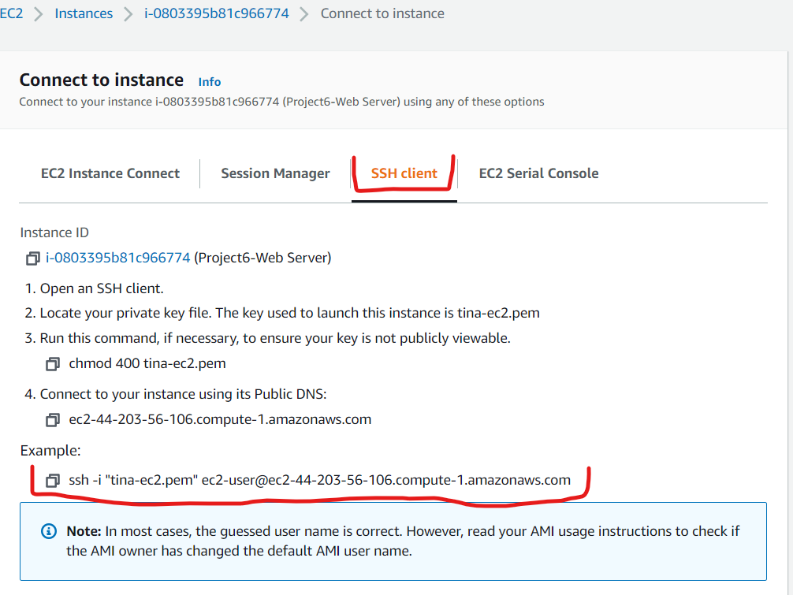
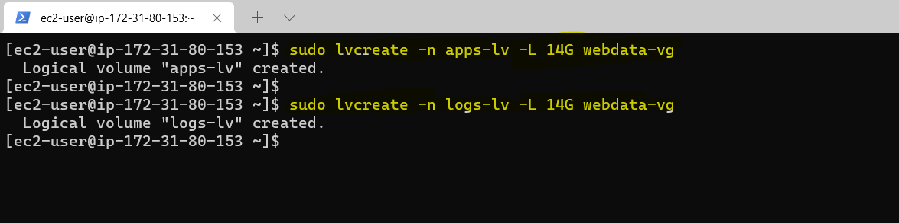
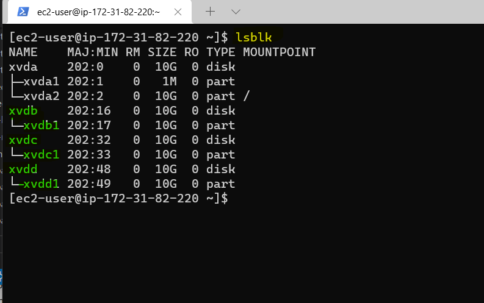
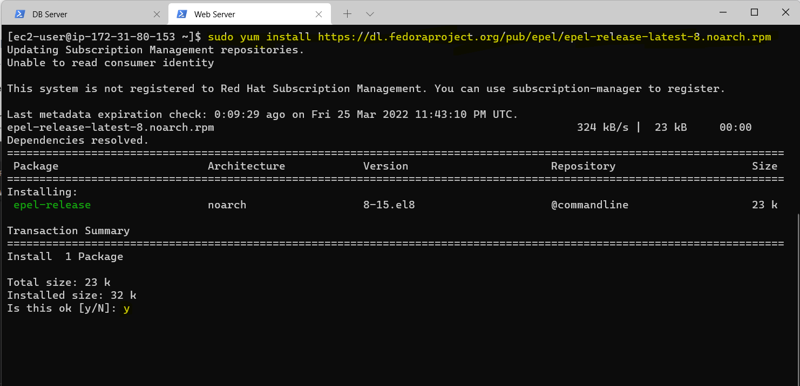
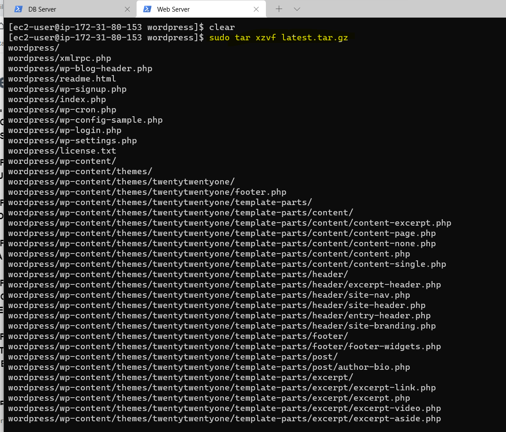

# Project 6
## Title: WEB SOLUTION WITH WORD PRESS
### Description: 
This Project describes implementing web solution with word press in AWS.

Web solutions are usually implemented with a three-tier architecture.

The three-tier architecture is a client-server software architecture with 3 separate layers:


* Presentation tier - This is the user interface such as a client server or browser.
* Application tier - This is the business layer. The backend program that implements business logic. it can be an application server or a web server.
* Data tier - This layer takes care of data storage and access. it can be a database server or a File system server such as an NFS server or an FTP server.

### Implementation Steps:
* STEP 1 - Prepare a web server with an EC2 instance runnung Red Hat Operating system, create three 10G volumes and add to instance 


  * Connect to EC2 instance via Windows terminal

  

  

  * Use "lsblk" command to inspect block devices attached to the server and confirm the three newly created block devices are present.
<!-- Code Blocks -->
```bash
$ lsblk
```
  


  * Use "df -h" command to see all mount points and free spaces on the server
  <!-- Code Blocks -->
```bash
$ df -h
```
  

  * Use "gdisk" utility to create a single partition on each of the 3 disks
  <!-- Code Blocks -->
```bash
$ sudo gdisk /dev/xvdb
```
  


 <!-- Code Blocks -->
```bash
$ sudo gdisk /dev/xvdc
```
  


<!-- Code Blocks -->
```bash
$ sudo gdisk /dev/xvdd
```
  


  * Use the "lsblk" utility to view new partitions on the three disks.
  <!-- Code Blocks -->
```bash
$ lsblk
```
  

  * Install the "lvm2" package and use the command "sudo lvmdiskscan" to check for available partitions.
  <!-- Code Blocks -->
```bash
$ sudo dnf install lvm2
```
  

  * Use the "pvcreate" utility to mark each of the three disks as physical volumes.
   <!-- Code Blocks -->
```bash
$ sudo pvcreate /dev/xvdb1
$ sudo pvcreate /dev/xvdc1
$ sudo pvcreate /dev/xvdd1
```
  

  * Use the command "sudo pvs" to verify that your physical volume has been created successfully.
  <!-- Code Blocks -->
```bash
$ sudo pvs
```
  

  * Use the "vgcreate" utility to add all 3 PVs to a volume group named "webdata-vg"
  <!-- Code Blocks -->
```bash
$ sudo vgcreate webdata-vg /dev/xvdb1 /dev/xvdc1 /dev/xvdd1
```
  

  * Use the command "sudo vgs" to verify that your volume group has been created successfully.
<!-- Code Blocks -->
```bash
$ sudo vgs
```
  

  * Use the "lvcreate" utility to create two logical volumes named "apps-lv" [will be used to store data for the website] and "logs-lv" [will be used to store data for logs]
<!-- Code Blocks -->
```bash
$ sudo lvcreate -n apps-lv -L 14G webdata-vg
$ sudo lvcreate -n logs-lv -L 14G webdata-vg
```
  

  * Use the command "sudo lvs" to verify that the logical volumes has been created successfully.
  <!-- Code Blocks -->
```bash
$ sudo lvs
```
  

  * Use the command "sudo vgdisplay" to view complete setup.
  <!-- Code Blocks -->
```bash
$ sudo lvdisplay
```
  

  * Format the logical volumes withext4 filesystem using the "mkfs.ext4" utility
   <!-- Code Blocks -->
```bash
$ sudo mkfs -t ext4 /dev/webdata-vg/apps-lv
$ sudo mkfs -t ext4 /dev/webdata-vg/logs-lv
```
  

  * Create the directory "/var/www/html" to store website files
<!-- Code Blocks -->
```bash
$ sudo mkdir -p /var/www/html
```
  


  * Create the directory "/home/recovery/logs" to store backup of log data.
  <!-- Code Blocks -->
```bash
$ sudo mkdir -p /home/recovery/logs
```
  

  * Mount "/var/www/html" on apps-lv logical volume
<!-- Code Blocks -->
```bash
  $ sudo mount /dev/webdata-vg/apps-lv /var/www/html/
  ```
  

  * Use the "rsync" utility to backup all the files in the log directory /var/log/ into /home/recovery/logs
  <!-- Code Blocks -->
```bash
  $ sudo rsync -av /var/log/. /home/recovery/logs/
  ```
  

  


  * Mount /var/log on logs-lv logical volume.
   <!-- Code Blocks -->
```bash
  $ sudo mount /dev/webdata-vg/logs-lv /var/log
  ```
  

   * Restore log files back into /var/log directory
     <!-- Code Blocks -->
```bash
  $ sudo rsync -av /home/recovery/logs/. /var/log
  ```
  

  

  * Update /etc/fstab file for persistence of mount configuration after restart of the server
  <!-- Code Blocks -->
```bash
  $ sudo blkid
  ```
  


<!-- Horizontal Rule -->
----------------------------------------------------

* STEP 2 - Prepare the Database server with an EC2 instance runnung Red Hat Operating system, create three 10G volumes and add to instance 


  * Connect to EC2 instance via Windows terminal

  

  

  * Use "lsblk" command to inspect block devices attached to the server and confirm the three newly created block devices are present.

<!-- Code Blocks -->
```bash
$ lsblk
```
 


  * Use "df -h" command to see all mount points and free spaces on the server
  <!-- Code Blocks -->
```bash
$ df -h
```
  

  * Use "gdisk" utility to create a single partition on each of the 3 disks
  <!-- Code Blocks -->
```bash
$ sudo gdisk /dev/xvdb
```
  


 <!-- Code Blocks -->
```bash
$ sudo gdisk /dev/xvdc
```
  


<!-- Code Blocks -->
```bash
$ sudo gdisk /dev/xvdd
```
  

  * Use the "lsblk" utility to view new partitions on the three disks.
  <!-- Code Blocks -->
```bash
$ lsblk
```
  

  * Install the "lvm2" package and use the command "sudo lvmdiskscan" to check for available partitions.
  <!-- Code Blocks -->
```bash
$ sudo dnf install lvm2
```
  

* Use the "pvcreate" utility to mark each of the three disks as physical volumes.
   <!-- Code Blocks -->
```bash
$ sudo pvcreate /dev/xvdb1
$ sudo pvcreate /dev/xvdc1
$ sudo pvcreate /dev/xvdd1
```
  

  * Use the command "sudo pvs" to verify that your physical volume has been created successfully.
  <!-- Code Blocks -->
```bash
$ sudo pvs
```
  

  * Use the "vgcreate" utility to add all 3 PVs to a volume group named "webdata-vg"
  <!-- Code Blocks -->
```bash
$ sudo vgcreate webdata-vg /dev/xvdb1 /dev/xvdc1 /dev/xvdd1
```
  

  * Use the command "sudo vgs" to verify that your volume group has been created successfully.
<!-- Code Blocks -->
```bash
$ sudo vgs
```
  

  * Use the "lvcreate" utility to create two logical volumes named "db-lv" [will be used to store data for the website] and "logs-lv" [will be used to store data for logs]
<!-- Code Blocks -->
```bash
$ sudo lvcreate -n db-lv -L 14G webdata-vg
$ sudo lvcreate -n logs-lv -L 14G webdata-vg
```
  

  * Use the command "sudo lvs" to verify that the logical volumes has been created successfully.
  <!-- Code Blocks -->
```bash
$ sudo lvs
```
  

  * Use the command "sudo vgdisplay" to view complete setup.
  <!-- Code Blocks -->
```bash
$ sudo lvdisplay
```
  

  * Format the logical volumes with ext4 filesystem using the "mkfs.ext4" utility
   <!-- Code Blocks -->
```bash
$ sudo mkfs -t ext4 /dev/webdata-vg/db-lv
$ sudo mkfs -t ext4 /dev/webdata-vg/logs-lv
```
  

  * Create the directory "/db" to store website files
<!-- Code Blocks -->
```bash
$ sudo mkdir /db
```
  


  * Create the directory "/home/recovery/logs" to store backup of log data
  <!-- Code Blocks -->
```bash
$ sudo mkdir -p /home/recovery/logs
```
  

  * Mount "/db" on apps-lv logical volume
<!-- Code Blocks -->
```bash
  $ sudo mount /dev/webdata-vg/db-lv /db
  ```
  

  * Use the "rsync" utility to backup all the files in the log directory /var/log/ into /home/recovery/logs
  <!-- Code Blocks -->
```bash
  $ sudo rsync -av /var/log/. /home/recovery/logs/
  ```
  

  * Mount /var/log on logs-lv logical volume.
   <!-- Code Blocks -->
```bash
  $ sudo mount /dev/webdata-vg/logs-lv /var/log
  ```
  

   * Restore log files back into /var/log directory
     <!-- Code Blocks -->
```bash
  $ sudo rsync -av /home/recovery/logs/. /var/log
  ```
  

  * Update /etc/fstab file for persistence of mount configuration after restart of the server
  <!-- Code Blocks -->
```bash
  $ sudo blkid
  ```
  


<!-- Horizontal Rule -->
----------------------------------------------------

* STEP 3 - Install WordPress on your Web Server EC2 Instance

 * Install wget, Apache and its dependencies
  <!-- Code Blocks -->
```bash
  $ sudo yum -y install wget httpd php php-mysqlnd php-fpm php-json
  ```
  

  * Start Apache Service
  <!-- Code Blocks -->
```bash
  $ sudo systemctl start httpd
  $ sudo systemctl enable httpd
  ```
  

  * Install PHP and its dependencies
  <!-- Code Blocks -->
```bash
  $ sudo yum install https://dl.fedoraproject.org/pub/epel/epel-release-latest-8.noarch.rpm

  $ sudo yum install yum-utils http://rpms.remirepo.net/enterprise/remi-release-8.rpm

  $ sudo yum module list php

  $ sudo yum module reset php

  $ sudo yum module enable php:remi-7.4

  $ sudo yum install php php-opcache php-gd php-curl php-mysqlnd

  ```
  


* Start PHP Service, 
  <!-- Code Blocks -->
```bash
  $ sudo systemctl start php-fpm

  $ sudo systemctl enable php-fpm

  $ sudo setsebool -P httpd_execmem 1

  ```
  

* Configure SElinux boolean and restart Apache Service
 <!-- Code Blocks -->
```bash
$ sudo setsebool -P httpd_execmem 1

$ sudo systemctl restart httpd
```


* Download wordpress and copy wordpress to /var/www/html
 <!-- Code Blocks -->
```bash
$ mkdir wordpress

$ cd wordpress

$ sudo wget http://wordpress.org/latest.tar.gz

$ sudo tar xzvf latest.tar.gz

$ sudo rm -rf latest.tar.gz

$ sudo cp wordpress/wp-config-sample.php wordpress/wp-config.php

$ sudo cp -R wordpress /var/www/html/
```





* Configure SELinux Policies
 <!-- Code Blocks -->
```bash
$ sudo chown -R apache:apache /var/www/html/wordpress

$ sudo chcon -t httpd_sys_rw_content_t /var/www/html/wordpress -R

$ sudo systemctl restart httpd
```


<!-- Horizontal Rule -->
----------------------------------------------------

* STEP 4 - Install MySQL on your DB Server EC2 Instance

* Install mysql-server package and ensure mysqld service is started and ensured.
 <!-- Code Blocks -->
```bash
$ sudo yum install mysql-server

$ sudo systemctl start mysqld

$ sudo systemctl enable mysqld

$ sudo systemctl status mysqld
```


<!-- Horizontal Rule -->
----------------------------------------------------


* STEP 5 - Configure DB to work with WordPress. Web Server IP Address (AWS Private IP Address) is used to create user and grant privileges.

<!-- Code Blocks -->
```bash
$ sudo mysql

mysql> CREATE DATABASE wordpress;

mysql> CREATE USER `apache`@`172.31.80.153` IDENTIFIED BY 'password';

mysql> GRANT ALL ON wordpress.* TO 'apache'@'172.31.80.153';

mysql> FLUSH PRIVILEGES;

mysql> SHOW DATABASES;

mysql> exit
```


<!-- Horizontal Rule -->
----------------------------------------------------

* STEP 6 - Configure WordPress to connect to remote database.

      Open MySQL port 3306 on DB Server EC2.

      Allow access to the DB server from only the Web Server`s IP address for extra security. 

      Inbound Rule configuration should specify /32.


* Install mysql client on Web Server and test that you can connect from the web server to the DB Server.

<!-- Code Blocks -->
```bash
$ sudo yum install mysql

$ sudo mysql -u apache -p -h 172.31.82.220     (this is DB Private IP Address)
```


* Change permissions and configuration so Apache could use WordPress: Edit the file wp-config.php to modify the values to correspond to the database hostname, database user and password.

<!-- Code Blocks -->
```bash
$ sudo vi /var/www/html/wordpress/wp-config.php
```


* Change permission for wordpress directory under /var/www/html

<!-- Code Blocks -->
```bash
$ sudo chmod -Rf 775 /
```


* Create Apache WordPress VirtualHost File.

<!-- Code Blocks -->
```bash
$ sudo vi /etc/httpd/conf.d/wordpress.conf
```


* Restart Apache

<!-- Code Blocks -->
```bash
$ sudo systemctl restart httpd
```


* Enable TCP port 80 in Inbound Rules configuration for your Web Server EC2 


* Test access from browser to WordPress http://<Web-Server-Public-IP-Address><184.73.144.139>/wordpress/


