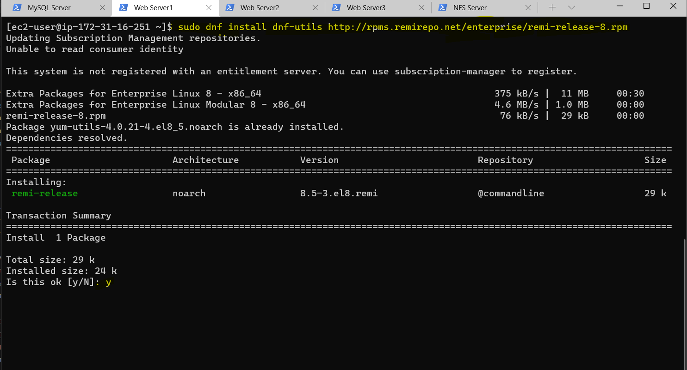
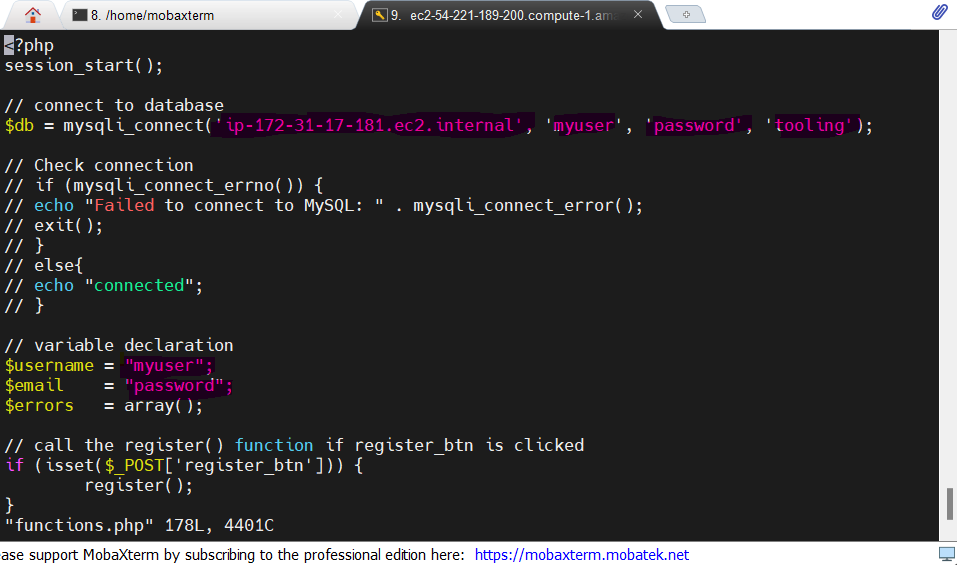
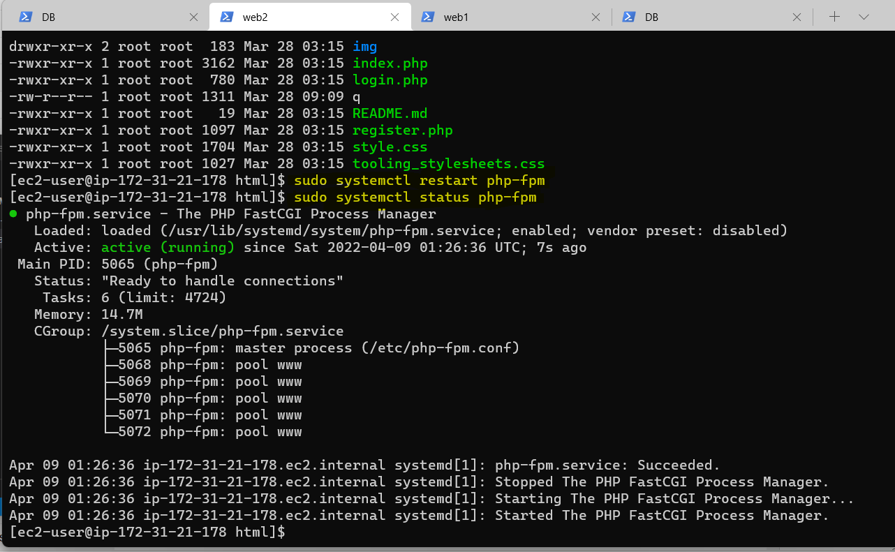
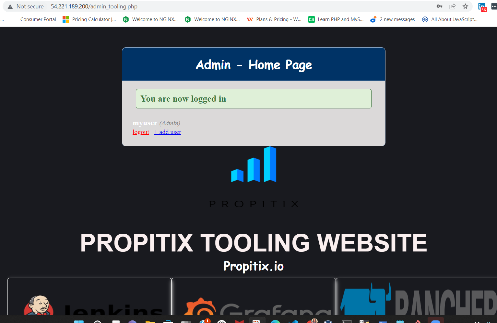

# Project 7
## Title: DEVOPS TOOLING WEBSITE SOLUTION
### TASK: 
Implement a Tooling website solution that makes access to DevOps tools within the coporate website easily accessible.

Tooling Solution:
1. Jenkins – free and open source automation server used to build CI/CD pipelines.
2. Kubernetes – an open-source container-orchestration system for automating computer application deployment, scaling, and management.
3. Jfrog Artifactory – Universal Repository Manager supporting all major packaging formats, build tools and CI servers. Artifactory.
4. Rancher – an open source software platform that enables organizations to run and manage Docker and Kubernetes in production.
5. Grafana – a multi-platform open source analytics and interactive visualization web application.
6. Prometheus – An open-source monitoring system with a dimensional data model, flexible query language, efficient time series database and modern alerting approach.
7. Kibana – Kibana is a free and open user interface that lets you visualize your Elasticsearch data and navigate the Elastic Stack

The implementation solution is a 3-tier Web Application Architecture with a single Database, and an NFS Server as a shared file storage. it will consist of the following component:

* Infrastructure: AWS
* Web Server Linux: Red Hat Enterprise Linux 8
* Database Server: Ubuntu 20.04 + MySQL
* Storage Server: Red Hat Enterprise Linux 8 + NFS Server
* Programming Language: PHP
* Code Repository: GitHub


<!-- Horizontal Rule -->
----------------------------------------------------

### Implementation Steps:
* Step 1 - Prepare NFS Server

Prepare a web server with an EC2 instance runnung Red Hat Operating system, create three 10G volumes and add to instance, connect to windows terminal, and Use "lsblk" command to inspect block devices attached to the server and confirm the three newly created block devices are present.

<!-- Code Blocks -->
```bash
$ lsblk
```
  

Use "gdisk" utility to create a single partition on each of the 3 disks
  <!-- Code Blocks -->
```bash
$ sudo gdisk /dev/xvdf
```
  


 <!-- Code Blocks -->
```bash
$ sudo gdisk /dev/xvdg
```
  

<!-- Code Blocks -->
```bash
$ sudo gdisk /dev/xvdh
```
  

  * Use the "lsblk" utility to view new partitions on the three disks.
  <!-- Code Blocks -->
```bash
$ lsblk
```
  

  * Install the "lvm2" package and use the command "sudo lvmdiskscan" to check for available partitions.
  <!-- Code Blocks -->
```bash
$ sudo dnf install lvm2
```
  

  * Use the "pvcreate" utility to mark each of the three disks as physical volumes.
   <!-- Code Blocks -->
```bash
$ sudo pvcreate /dev/xvdf1
$ sudo pvcreate /dev/xvdg1
$ sudo pvcreate /dev/xvdh1
```
  

  * Use the command "sudo pvs" to verify that your physical volume has been created successfully.
  <!-- Code Blocks -->
```bash
$ sudo pvs
```
  

  * Use the "vgcreate" utility to add all 3 PVs to a volume group named "webdata-vg"
  <!-- Code Blocks -->
```bash
$ sudo vgcreate webdata-vg /dev/xvdf1 /dev/xvdg1 /dev/xvdh1
```
  

  * Use the command "sudo vgs" to verify that your volume group has been created successfully.
<!-- Code Blocks -->
```bash
$ sudo vgs
```
  

  * Use the "lvcreate" utility to create two logical volumes named "apps-lv" [will be used to store data for the website] and "logs-lv" [will be used to store data for logs]
<!-- Code Blocks -->
```bash
$ sudo lvcreate -n lv-opt -L 9G webdata-vg
$ sudo lvcreate -n lv-apps -L 9G webdata-vg
$ sudo lvcreate -n lv-logs -L 9G webdata-vg
```
  

  * Use the command "sudo lvs" to verify that the logical volumes has been created successfully.
  <!-- Code Blocks -->
```bash
$ sudo lvs
```
  

  * Use the command "sudo vgdisplay" to view complete setup.
  <!-- Code Blocks -->
```bash
$ sudo lvdisplay
```
  

  * Format the logical volumes with xfs filesystem using the "mkfs.xfs" utility
   <!-- Code Blocks -->
```bash
$ sudo mkfs -t xfs /dev/webdata-vg/lv-opt
$ sudo mkfs -t xfs /dev/webdata-vg/lv-apps
$ sudo mkfs -t xfs /dev/webdata-vg/lv-logs

```
  

  

* Create mount points on /mnt directory for the logical volumes.

Mount lv-apps on /mnt/apps – To be used by webservers
Mount lv-logs on /mnt/logs – To be used by webserver logs
Mount lv-opt on /mnt/opt – To be used by Jenkins server in Project 8

 <!-- Code Blocks -->
```bash
$ sudo mkdir /mnt/apps
$ sudo mkdir /mnt/logs
$ sudo mkdir /mnt/opt

```
  

  * Install NFS server, configure it to start on reboot and make sure it is u and running

 <!-- Code Blocks -->
```bash
$ sudo yum -y update
$ sudo yum install nfs-utils -y
$ sudo systemctl start nfs-server.service
$ sudo systemctl enable nfs-server.service
sudo systemctl status nfs-server.service

```
  

  

  

  * Export the mounts for webservers’ subnet cidr to connect as clients.

  

  * Set up permission that will allow our Web servers to read, write and execute files on NFS.

   <!-- Code Blocks -->
```bash
$ sudo chown -R nobody: /mnt/apps
$ sudo chown -R nobody: /mnt/logs
$ sudo chown -R nobody: /mnt/opt
$ sudo chmod -R 777 /mnt/apps
$ sudo chmod -R 777 /mnt/logs
$ sudo chmod -R 777 /mnt/opt
```
  

* Restart NFS Server

   <!-- Code Blocks -->
```bash
$ sudo systemctl restart nfs-server.service
```


* Configure access to NFS for clients within the same subnet (example of Subnet CIDR – e.g 172.31.16.0/20)

  <!-- Code Blocks -->
```bash
$ sudo vi /etc/exports

/mnt/apps 172.31.16.0/20(rw,sync,no_all_squash,no_root_squash)
/mnt/logs 172.31.16.0/20(rw,sync,no_all_squash,no_root_squash)
/mnt/opt 172.31.16.0/20(rw,sync,no_all_squash,no_root_squash)


$ sudo sudo exportfs -arv
```


* Check which port is used by NFS and open it using Security Groups (add new Inbound Rule)


Important note: In order for NFS server to be accessible from your client, you must also open following ports: TCP 111, UDP 111, UDP 2049


<!-- Horizontal Rule -->
----------------------------------------------------

* Step 2 - Configure the Database Server

On the Ubuntu server, 

1. Install MySQL server software.

2. Create a database and name it tooling

3. Create a database user and name it webaccess.

4. Grant permission to webaccess user on tooling database to do anything only from the webservers subnet CIDR (172.31.16.0/20)

<!-- Code Blocks -->
```bash
$ sudo apt update
```
Updating package repository


<!-- Code Blocks -->
```bash
$ sudo apt upgrade
```
Upgrading package repository


<!-- Code Blocks -->
```bash
$ sudo apt install mysql-server
```


<!-- Code Blocks -->
```bash
$ sudo mysql_secure_installation
```
Configuring MySQL


<!-- Code Blocks -->
```bash
$ sudo systemctl status mysql
```
Checking the status of mysql service


Log into MySQL Server, Create database (tooling), create user (webaccess)

<!-- Code Blocks -->
```bash
$ sudo mysql -u root -p

mysql> CREATE DATABASE tooling;

mysql> CREATE USER `webaccess`@`172.31.16.0/20` IDENTIFIED BY 'password';

mysql> GRANT ALL ON tooling.* TO 'webaccess'@'172.31.16.0/20';

mysql> FLUSH PRIVILEGES;

mysql> SHOW DATABASES;

mysql> exit

```


* Configuring mysql server to allow connections from remote hosts
<!-- Code Blocks -->
```bash
$ sudo vi /etc/mysql/mysql.conf.d/mysqld.cnf

Replace ‘127.0.0.1’ to ‘0.0.0.0’

$ sudo systemctl restart mysqld
```


<!-- Horizontal Rule -->
----------------------------------------------------

* Step 3 - Configure the Web Servers.
The Web Servers can serve the same content from shared storage solutions (The NFS Server and the MySQL Database Server).
The Database will store shared files that the Web Servers will use.
The NFS Server will mount lv-apps to the folder where Apache stores files to be served to the users (/var/www). This approach will make the Web Servers stateless, meaning new data can be added, and old data can be removed when needed, and the integrity of the data  (in the database and on NFS) will be preserved. 

* Launch 3 new Instances with RHEL8 Operating system for the 3 Web Servers. They should be on the same webservers subnet CIDR (172.31.16.0/20) as the NFS Server.

* Install NFS client
<!-- Code Blocks -->
```bash
$ sudo yum update

$ sudo yum install nfs-utils nfs4-acl-tools -y
```


* Mount /var/www/ and target the NFS server’s export for apps on all 3 Web Servers

Web Server 1
<!-- Code Blocks -->
```bash
$ sudo mkdir /var/www

$ sudo mount -t nfs -o rw,nosuid 172.31.30.252:/mnt/apps /var/www
```


Web Server 2
<!-- Code Blocks -->
```bash
$ sudo mkdir /var/www

$ sudo mount -t nfs -o rw,nosuid 172.31.30.252:/mnt/apps /var/www
```


Web Server 3
<!-- Code Blocks -->
```bash
$ sudo mkdir /var/www

$ sudo mount -t nfs -o rw,nosuid <NFS-Server-Private-IP-Address>:/mnt/apps /var/www       (172.31.30.252)
```


* Verify that NFS was mounted successfully by running df -h
<!-- Code Blocks -->
```bash
$ df -h
```

Web Server 1


Web Server 2


Web Server 3


* Make sure that the changes will persist on Web Server after reboot:
<!-- Code Blocks -->
```bash
$ sudo vi /etc/fstab
```
add the following line to fstab file

172.31.30.252:/mnt/apps /var/www nfs defaults 0 0


<!-- Horizontal Rule -->
----------------------------------------------------

* Install Remi’s repository, EPEL repository, Apache and PHP
<!-- Code Blocks -->
```bash
$ sudo yum install httpd -y

$ sudo dnf install https://dl.fedoraproject.org/pub/epel/epel-release-latest-8.noarch.rpm

$ sudo dnf install dnf-utils http://rpms.remirepo.net/enterprise/remi-release-8.rpm

$ sudo dnf module reset php

$ sudo dnf module enable php:remi-7.4

$ sudo dnf install php php-opcache php-gd php-curl php-mysqlnd
```
add the following line to fstab file

172.31.30.252:/mnt/apps /var/www nfs defaults 0 0





* Start and Enable Apache Service and PHP Service
<!-- Code Blocks -->
```bash
$ sudo systemctl start php-fpm

$ sudo systemctl enable php-fpm

$ sudo systemctl status php-fpm

$ sudo systemctl start httpd

$ sudo systemctl enable httpd

$ sudo systemctl status httpd
```


* Configure SELinux Boolean
<!-- Code Blocks -->
```bash
$ sudo setsebool -P httpd_execmem 1
```


* Verify that Apache files and directories are available on the Web Server in /var/www and also on the NFS server in /mnt/apps.

If you see the same files – it means NFS is mounted correctly. You can try to create a new file touch test.txt from one server and check if the same file is accessible from other Web Servers.

Web Server 2


Web Server 3


Web Server 1


* Locate the log folder for Apache on the Web Server and mount it to NFS server’s export for logs. Repeat step №4 to make sure the mount point will persist after reboot.

Apache log folder /var/log/httpd

* Create the directory "/home/recovery/logs" to store backup of log data (/var/log/httpd)
<!-- Code Blocks -->
```bash
$ sudo mkdir -p /home/recovery/logs
```


* Use the "rsync" utility to backup all the files in the log directory /var/log/ into /home/recovery/logs
<!-- Code Blocks -->
```bash
$ sudo rsync -av /var/log/httpd /home/recovery/logs/
```


* Mount /var/log/httpd on /mnt/logs
<!-- Code Blocks -->
```bash
$ sudo mount -t nfs -o rw,nosuid 172.31.30.252:/mnt/logs /var/log/httpd         (NFS-Server-Private-IP-Address)
```


* Verify that NFS was mounted successfully by running df -h
<!-- Code Blocks -->
```bash
$ df -h
```


* Restore log files back into /var/log directory

<!-- Code Blocks -->
```bash
$ sudo rsync -av /home/recovery/logs/. /var/log/httpd
```


* Fork the tooling source code from Darey.io Github Account to your Github account. 


* Configure SELinux Policies by disabling SELinux because /var/www/html and var/log/httpd is mounted with nfs and has  different file context.
<!-- Code Blocks -->
```bash
$ sudo vi /etc/sysconfig/selinux
```
replace enforcing with disabled


* Update the website’s configuration to connect to the database (in /var/www/html/functions.php file). Apply tooling-db.sql script to your database using this command mysql -h <databse-private-ip> -u <db-username> -p <db-pasword> < tooling-db.sql
<!-- Code Blocks -->
```bash
$ sudo yum install mysql

$ sudo vi /var/www/html/function.php

$  sudo mysql -h 172.31.93.78 -u webaccess -p

mysql>  source /home/ec2-user/tooling-master/tooling-db.sql

```


* Edit functions.php file in /var/www/html directory in Web Server to reflect user details and database info



* Restart httpd service and php-fpm service




* Open the website in your browser http://<webserverPubAddr/index.php

