# Project 8
## Title: LOAD BALANCER SOLUTION WITH APACHE
### TASK: 
Deploy and configure an Apache Load Balancer for Tooling Website solution on a separate Ubuntu EC2 instance. Make sure users can be served by Web servers through the Load Balancer. This solution will be implemented with 2 Web Servers.

#### Implementation
The following servers are already installed and configured from Project-7:

Two RHEL8 Web Servers
One MySQL DB Server (based on Ubuntu 20.04)
One RHEL8 NFS server

One Ubuntu Apache Load Balancer Server (20.04) will be configured.

####Architecture

 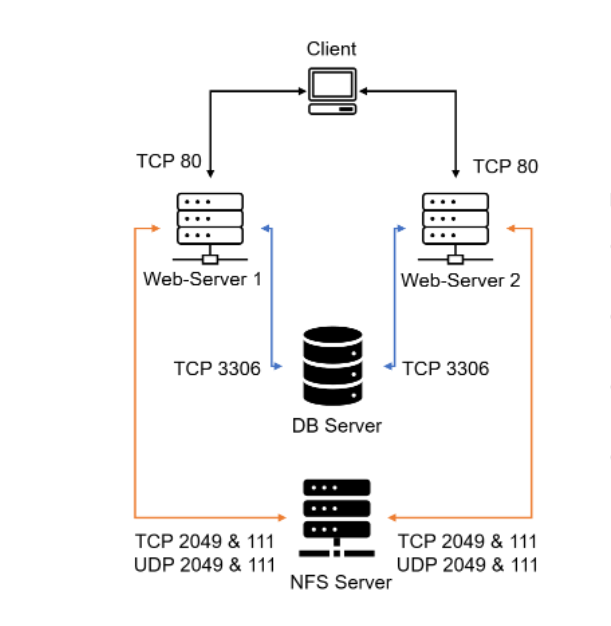
  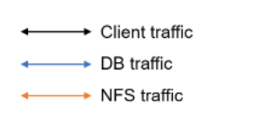

  Initial Configuration

  * Apache (httpd) process is up and running on both Web Server 1 and Web Server 2.

  Web Server1
  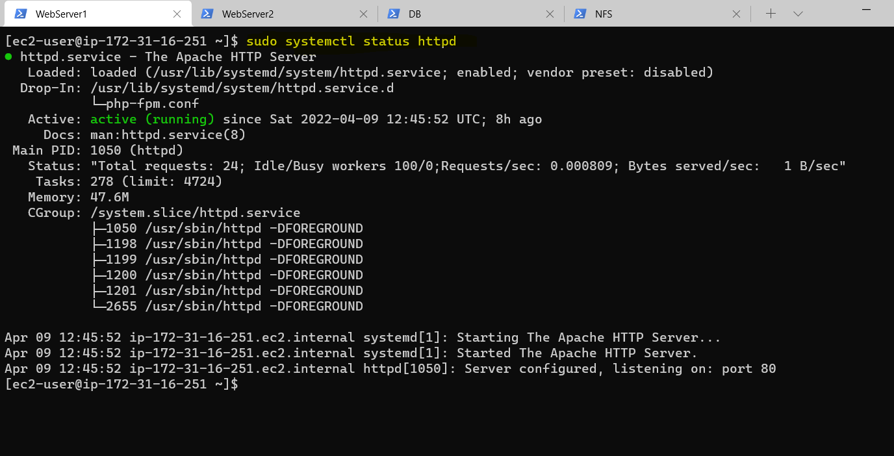

  Web Server2
  

  * '/var/www' directories of both Web Servers are mounted to '/mnt/apps' of NFS server.

  Web Server1
  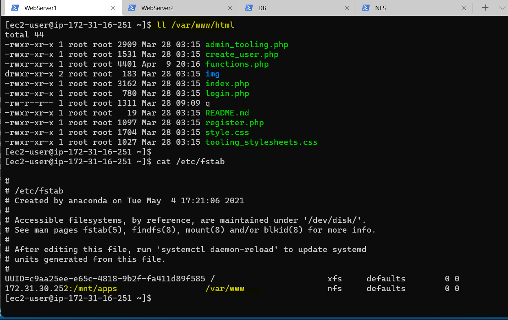

  Web Server2
  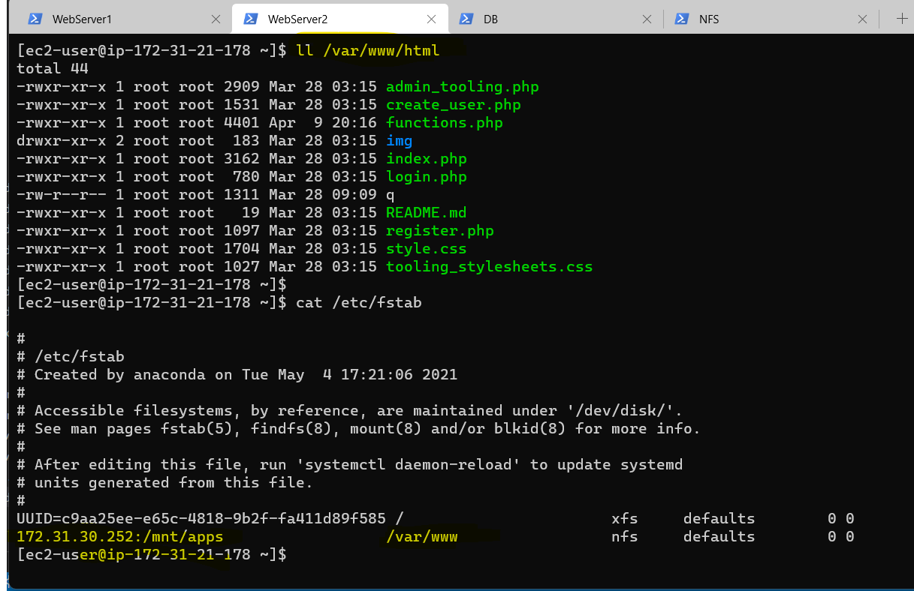


  * All neccessary TCP/UDP ports are open Web Server 1, Web Server2, DB Server, and NFS Servers.

  * Client browser can access both Web Servers by their respective Public IP Addresses or Public DNS names and can open the Tooling Website e.g http://<Public-IP-Address or Public-DNS-Name>/index.php)

  Web Server1
  

  Web Server2
   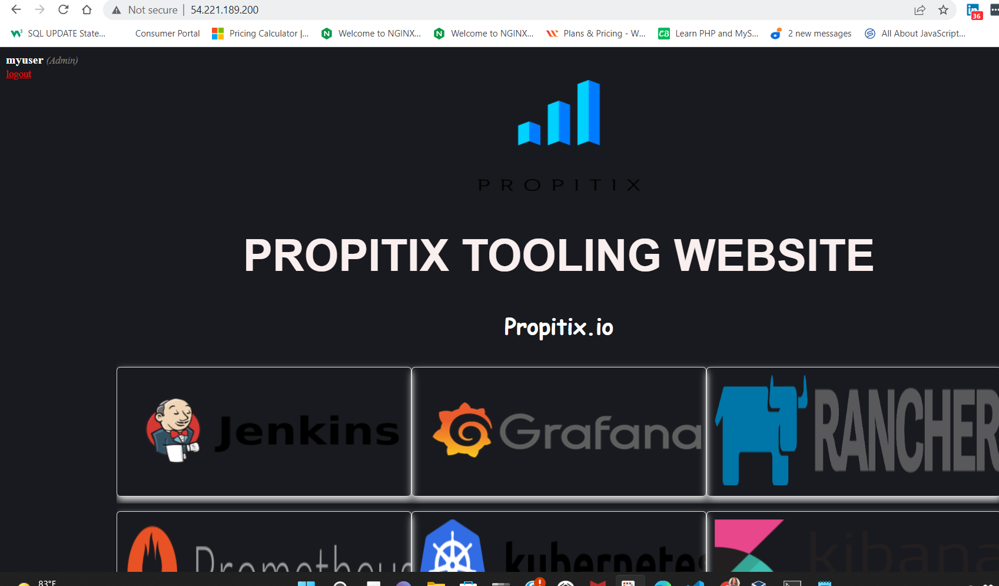


* Open TCP port 80 by creating an Inbound Rule in Security Group

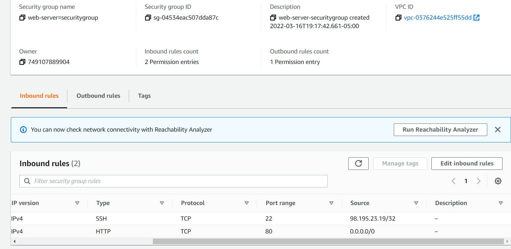

* Configure and Install Apache Load Balancer on Project-8-apache-lb server and configure it to point traffic coming to LB to both Web Servers:

* Install apache2

<!-- Code Blocks -->
```bash
$ sudo apt update

$ sudo apt upgrade

$ sudo apt install apache2 -y

$ sudo apt-get install libxml2-dev
```
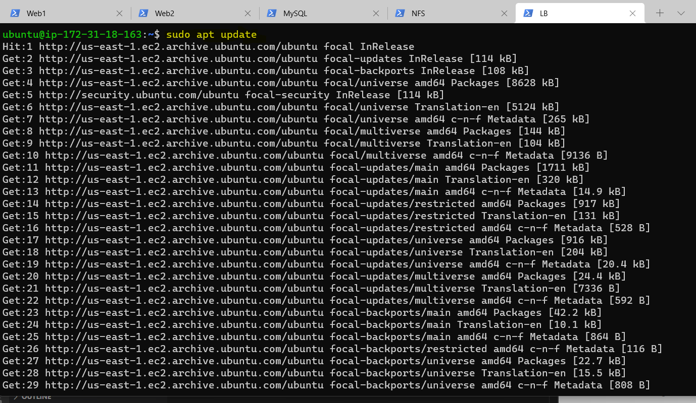

 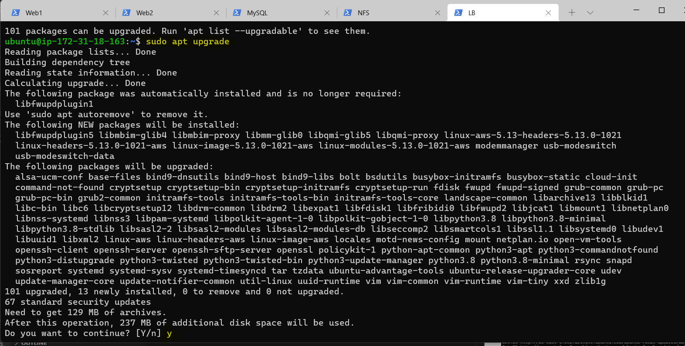 

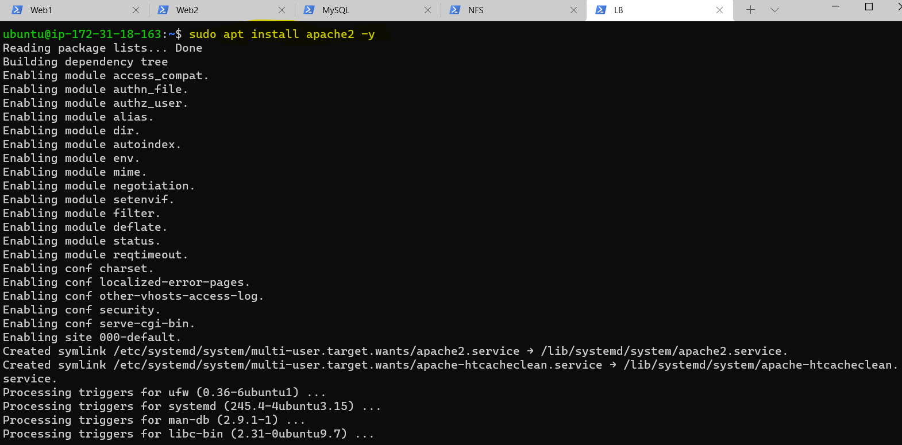 

 
 
* Enable following modules:

<!-- Code Blocks -->
```bash
$ sudo a2enmod rewrite

$ sudo a2enmod proxy

$ sudo a2enmod proxy_balancer

$ sudo a2enmod proxy_http

$ sudo a2enmod headers

$ sudo a2enmod lbmethod_bytraffic
```
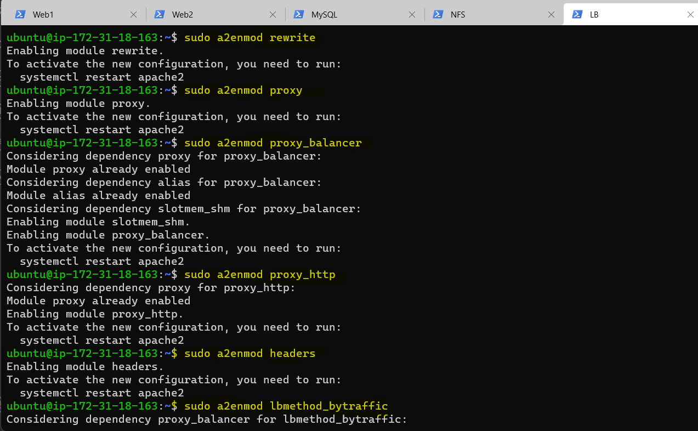

* Restart apache2 service
<!-- Code Blocks -->
```bash
$ sudo systemctl restart apache2
```
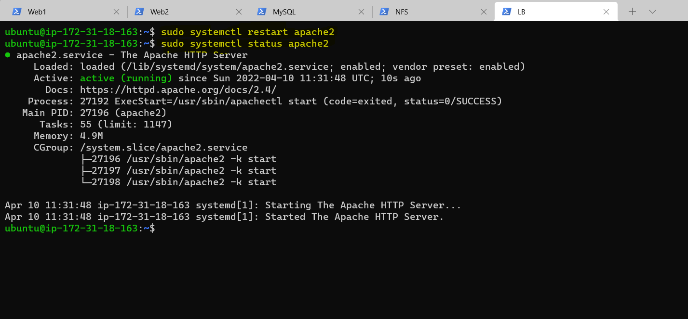

* Configure Local DNS Name Resolution for Web Servers
<!-- Code Blocks -->
```bash
$ sudo vi /etc/hosts
```
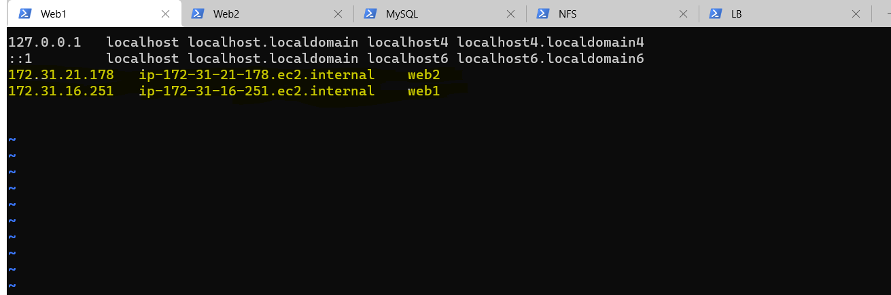


* Configure load balancing
<!-- Code Blocks -->
```bash
$ sudo vi /etc/apache2/sites-available/000-default.conf
```
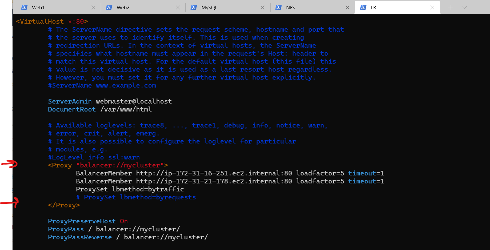

* Restart apache server
<!-- Code Blocks -->
```bash
$ sudo systemctl restart apache2
```
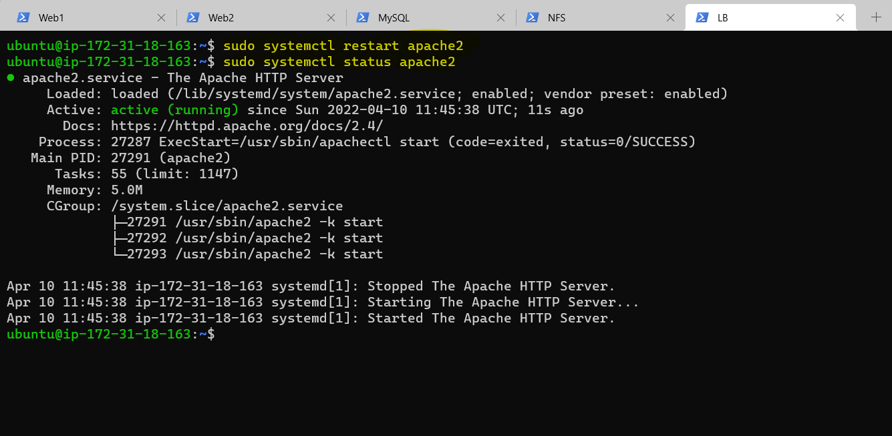

* Verify that our configuration works – try to access your LB’s public IP address or Public DNS name from your browser(54.235.19.149)

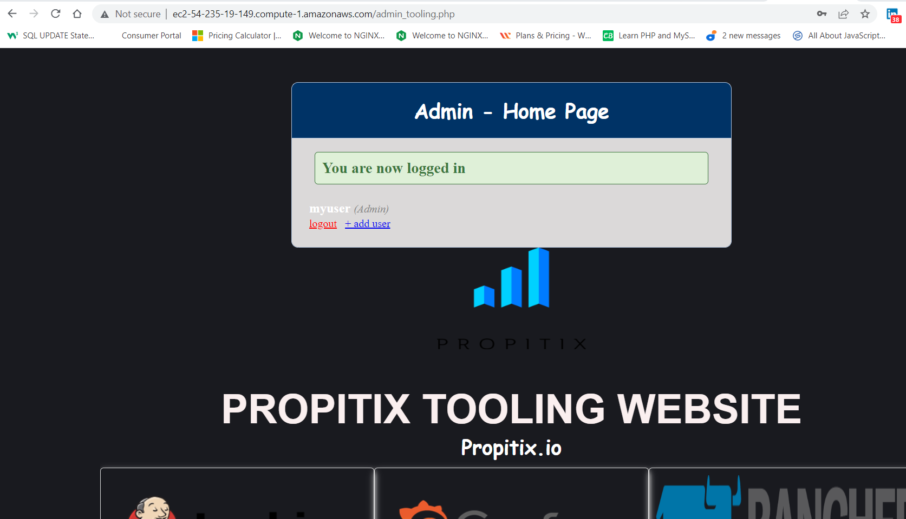

* unmounted /var/log/httpd/ from your Web Servers to the NFS server and make sure that each Web Server has its own log directory.
<!-- Code Blocks -->
```bash
$ sudo vi /etc/fstab

$ sudo umount /var/www
```
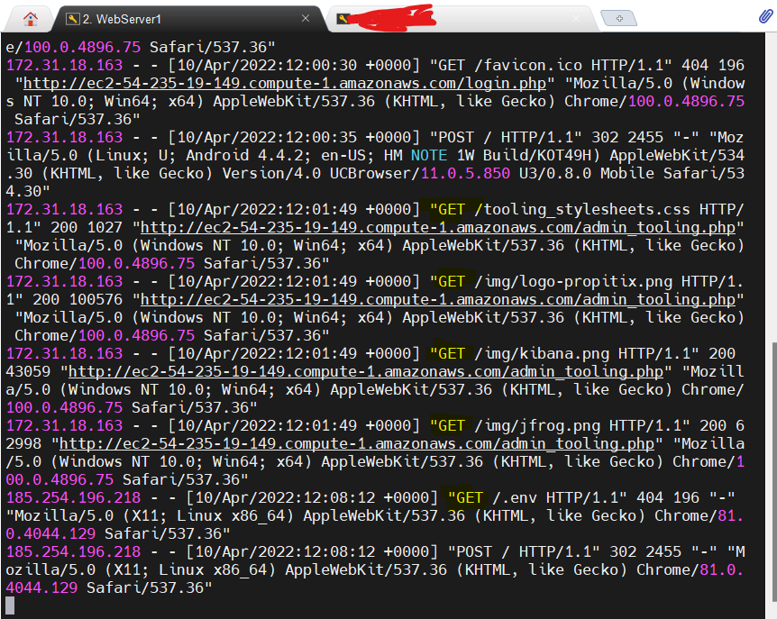

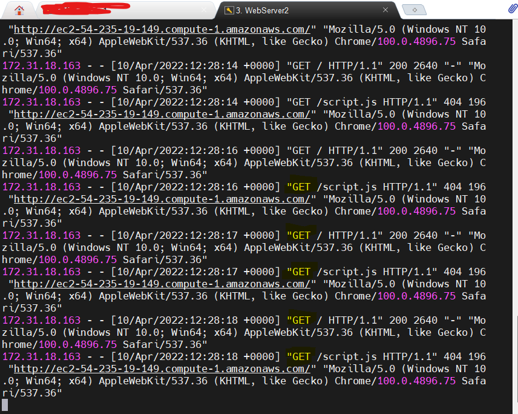
