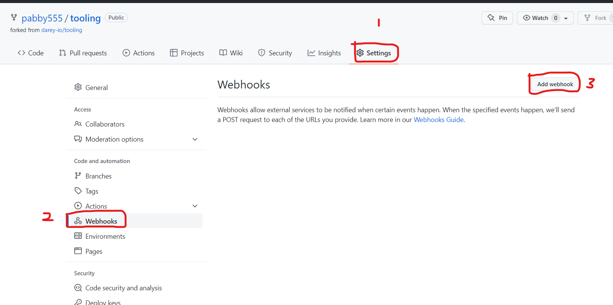

# Project 9
## Title: TOOLING WEBSITE DEPLOYMENT AUTOMATION WITH CONTINUOUS INTEGRATION. INTRODUCTION TO JENKINS
### TASK: 
Acording to Circle CI, Continuous integration (CI) is a software development strategy that increases the speed of development while ensuring the quality of the code that teams deploy. Developers continually commit code in small increments (at least daily, or even several times a day), which is then automatically built and tested before it is merged with the shared repository. In our project we are going to utilize Jenkins CI capabilities to make sure that every change made to the source code in GitHub https://github.com/pabby555/tooling will be automatically updated to the Tooling Website.

The architecture prepared in Project 8 will be enhanced by adding a Jenkins server. A job will be configured to automatically deploy source codes changes from Git to NFS server.


<!-- Horizontal Rule -->
----------------------------------------------------
#### Implementation
1.  - INSTALL AND CONFIGURE JENKINS SERVER

* Create an AWS EC2 server based on Ubuntu Server 20.04 LTS and name it "Jenkins"


* Install JDK (since Jenkins is a Java-based application)
 <!-- Code Blocks -->
```bash
$ sudo apt update
$ sudo apt upgrade
$ sudo apt install default-jdk-headless
```
  

  

  

* Install Jenkins
 <!-- Code Blocks -->
```bash
$ wget -q -O - https://pkg.jenkins.io/debian-stable/jenkins.io.key | sudo apt-key add -
sudo sh -c 'echo deb https://pkg.jenkins.io/debian-stable binary/ > /etc/apt/sources.list.d/jenkins.list'
$ sudo apt update
$ sudo apt-get install jenkins
```
  

  

* Start and Enable Jenkins Service
<!-- Code Blocks -->
```bash
$ sudo systemctl enable jenkins
$ sudo systemctl start jenkins
$ sudo systemctl status jenkins
```
  

* By default Jenkins server uses TCP port 8080 – open it by creating a new Inbound Rule in your EC2 Security Group


* Perform initial Jenkins setup

* From your browser access http://<Jenkins-Server-Public-IP-Address-or-Public-DNS-Name>:8080  (ec2-54-172-18-150.compute-1.amazonaws.com:8080)


* You will be prompted to provide a default admin password. Retrieve it from your server:
<!-- Code Blocks -->
```bash
$ sudo cat /var/lib/jenkins/secrets/initialAdminPassword
```
  

* Add the password on the webpage, and you will be asked which plugings to install – choose suggested plugins.


* Once plugins installation is done – create an admin user and you will get your Jenkins server address.

The installation is completed!


<!-- Horizontal Rule -->
----------------------------------------------------

2.  - Configure a simple Jenkins job/project (these two terms can be used interchangeably) to retrieve source codes from GitHub using Webhooks. This job will will be triggered by GitHub webhooks and will execute a ‘build’ task to retrieve codes from GitHub and store it locally on Jenkins server.

* Enable webhooks in your GitHub repository settings




* Go to Jenkins web console, click "New Item" and create a "Freestyle project"


* Copy your GitHub URL To connect your GitHub repository


* In configuration of the Jenkins "freestyle project" choose "Git repository", provide there the link to your Tooling GitHub repository and credentials (user/password) so Jenkins could access files in the repository.


* Save the configuration. Click "Build Now" button.


* Open the build and check in "Console Output" if it has run successfully.


* This build does not produce anything and it runs only when we trigger it manually. we need to configure. Click "Configure" your job/project and add these two configurations

1. Configure triggering the job from GitHub webhook:

2. Configure "Post-build Actions" to archive all the files – files resulted from a build are called "artifacts".


* make some change in any file in your GitHub repository (e.g. README.MD file) and push the changes to the master branch.


* You have now configured an automated Jenkins job that receives files from GitHub by webhook trigger (this method is considered as ‘push’ because the changes are being ‘pushed’ and files transfer is initiated by GitHub). There are also other methods: trigger one job (downstreadm) from another (upstream), poll GitHub periodically and others.

By default, the artifacts are stored on Jenkins server locally

ls /var/lib/jenkins/jobs/tooling_github/builds/<build_number>/archive/


<!-- Horizontal Rule -->
----------------------------------------------------
3. CONFIGURE JENKINS TO COPY FILES TO NFS SERVER VIA SSH

* Configure Jenkins to copy files to NFS server via SSH. The artifacts are saved locally on Jenkins server, the next step is to copy them to our NFS server to "/mnt/apps" directory.

Jenkins is a highly extendable application and there are 1400+ plugins available. We will need a plugin that is called "Publish Over SSH".

Install "Publish Over SSH" plugin.
On main dashboard select "Manage Jenkins" and choose "Manage Plugins" menu item.

On "Available" tab search for "Publish Over SSH" plugin and install it


* Configure the job/project to copy artifacts over to NFS server.

On main dashboard select "Manage Jenkins" and choose "Configure System" menu item.

Scroll down to Publish over SSH plugin configuration section and configure it to be able to connect to your NFS server:

Provide a private key (content of .pem file that you use to connect to NFS server via SSH/Putty)
Arbitrary name
Hostname – can be private IP address of your NFS server
Username – ec2-user (since NFS server is based on EC2 with RHEL 8)
Remote directory – /mnt/apps since our Web Servers use it as a mointing point to retrieve files from the NFS server


* Save the configuration, open your Jenkins job/project configuration page and add another one "Post-build Action"


* Configure it to send all files probuced by the build into our previouslys define remote directory. In our case we want to copy all files and directories – so we use **.


* Save this configuration and go ahead, change something in README.MD file in your GitHub Tooling repository.

Webhook will trigger a new job and in the "Console Output" of the job you will find something like this:

SH: Transferred 25 file(s)
Finished: SUCCESS
To make sure that the files in /mnt/apps have been udated – connect via SSH/Putty to your NFS server and check README.MD file

cat /mnt/apps/README.md


